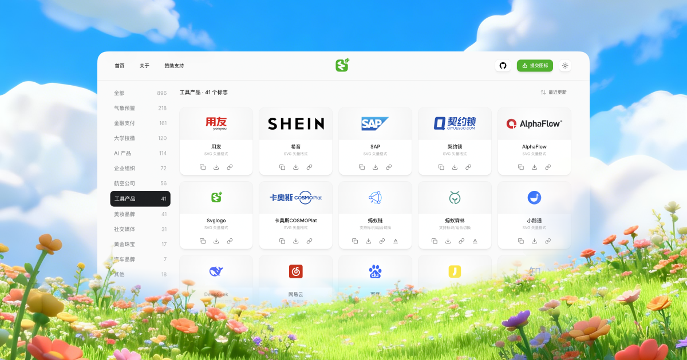

<div align="center">
<a href="https://svgl.app">

</a>
<p></p>
</div>

<div align="center">
    <a href="https://svglogo.top/" target="_blank">
        前往网站
    </a>
    <span>&nbsp;✦&nbsp;</span>
    <a href="https://tally.so/r/3qOv78">
        提交图标
    </a>
     <span>&nbsp;✦&nbsp;</span>
     <a href="https://huazi.space/">
       关于我
    </a>
</div>

## 关于
本站将专注收录国内矢量 LOGO 素材，目前包含国内社媒、大学校徽、气象预警及工具产品等。<br>
正持续收录中……<br>
欢迎 [提交or反馈](https://tally.so/r/3qOv78) 你想要的 LOGO <br>
你可以在[svgl](https://svgl.app/) 找到国外热门矢量 LOGO，本站也基于此开源项目开发。<br>
还可以在[urongda](https://www.urongda.com/)找到更全的中国大学矢量校徽和相关物料。
## 支持我
👋 嗨！我是 **Huazi** 你可以通过**微信**、**支付宝**支持我持续更新


## 版权
本网站展示的矢量图形均为网络搜集、整理，仅供学习参考，不保证其权威性、准确性。其版权均严格归属于各自对应公司机构。严禁未经授权的复制、修改、传播或商业使用。本网站无法对用户使用LOGO后的具体行为及其法律后果承担责任。

## 感谢以下朋友和和开源项目
感谢 **@猫柚 @小柒** 教我如何部署项目 <br>
本站基于开源项目 [svgl](https://github.com/pheralb/svgl) 开发制作<br>
[中国大学矢量校徽合集](https://www.figma.com/community/file/916515339708288305) @普鲁文<br>
[预警信号ICON](https://www.figma.com/community/file/1133299341246601360) @岩鸣杨子<br>


## 🛠️ 技术栈

- [**Sveltekit**](https://kit.svelte.dev/) - Web development, streamlined.
- [**Typescript**](https://www.typescriptlang.org/) - JavaScript with syntax for types.
- [**mdsvex**](https://mdsvex.com/) - Markdown for Svelte apps.
- [**Shiki**](https://github.com/shikijs/shiki) - A beautiful Syntax Highlighter.
- [**Tailwindcss**](https://tailwindcss.com/) - A utility-first CSS framework for rapidly building custom designs.
- [**bits-ui**](https://www.bits-ui.com) - A collection of headless components for Svelte.
- [**clsx**](https://github.com/lukeed/clsx) + [**tailwind-merge**](https://github.com/dcastil/tailwind-merge) inspired by [shadcn/ui](https://ui.shadcn.com) - A tiny utility for constructing `className` strings conditionally.
- [**Prettier**](https://prettier.io/) + [prettier-plugin-tailwindcss](https://github.com/tailwindlabs/prettier-plugin-tailwindcss) - An opinionated code formatter.
- [**Lucide Icons**](https://lucide.dev/) + [**phosphor-svelte**](https://github.com/haruaki07/phosphor-svelte) - A clean and friendly icons libraries.
- [**svelte-sonner**](https://github.com/wobsoriano/svelte-sonner) - An opinionated toast component for Svelte.
- [**@svgr/core**](https://react-svgr.com/) - Node.js utility to transform SVGs into React components.
- [**@upstash/redis** + **@upstash/ratelimit**](https://upstash.com/) - Serverless Redis for developers.
- [**Vitest**](https://vitest.dev/) - Blazing Fast Unit Test Framework.

## 🚀 启动项目

> [!IMPORTANT]
> Before submitting the SVG, **make sure that you have permission** or that the license of the SVG allows you to add it to svgl. If you are not sure, please contact the company or author.

You will need:

- [Node.js 16+ (recommended 18 LTS)](https://nodejs.org/en/).
- [Git](https://git-scm.com/).

1. [Fork](https://github.com/pheralb/svgl/fork) this repository and clone it locally:

```bash
git clone git@github.com:your_username/svgl.git
```

2. Install dependencies:

```bash
# Install pnpm globally if you don't have it:
npm install -g pnpm

# and install dependencies:
pnpm install
```

3. Go to the [**`static/library`**](https://github.com/pheralb/svgl/blob/main/static/library) folder and add your `.svg` logo.


4. Go to the [**`src/data/svgs.ts`**](https://github.com/pheralb/svgl/blob/main/src/data/svgs.ts) and add the information about your logo, following the structure:

- If the logo is a solid color:

```json
{
  "title": "Title",
  "category": "Category",
  "route": "/library/your_logo.svg",
  "url": "Website"
}
```

- If the logo has logo + wordmark version:

```json
{
  "title": "Title",
  "category": "Category",
  "route": "/library/your_logo.svg",
  "wordmark": "/library/your_logo_wordmark.svg",
  "url": "Website"
}
```

- If the logo/wordmark has light and dark mode:

```json
{
  "title": "Title",
  "category": "Category",
  "route": {
    "light": "/library/your_logo_light.svg",
    "dark": "/library/your_logo_dark.svg"
  },
  "wordmark": {
    "light": "/library/your_wordmark-logo_light.svg",
    "dark": "/library/your_wordmark-logo_dark.svg"
  },
  "url": "Website"
}
```

> [!NOTE]
>
> - The list of categories is here: [`src/types/categories.ts`](https://github.com/pheralb/svgl/blob/main/src/types/categories.ts). You can add a new category if you need it.
> - You can add multiple categories to the same logo, for example: `"category": ["Social", "Design"]` (max 3 categories per logo).

And create a pull request with your logo 🚀.

5. (Optional) If you want to run the [API](https://svgl.app/api) locally, you will need to create a `.env` file in the root of the project with the following variables:

- [Create a Upstash account](https://console.upstash.com/).
- [Create a Upstash Redis Database](https://upstash.com/docs/redis/overall/getstarted).

```bash
SVGL_API_REQUESTS = 1
UPSTASH_REDIS_URL = ""
UPSTASH_REDIS_TOKEN = ""
```                                            |

## ✌️ Contributing


## 🔑 License

- [MIT](https://github.com/pheralb/svgl/blob/main/LICENSE).
